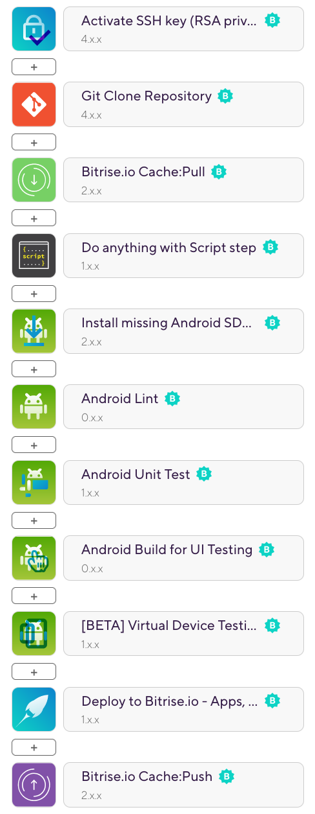
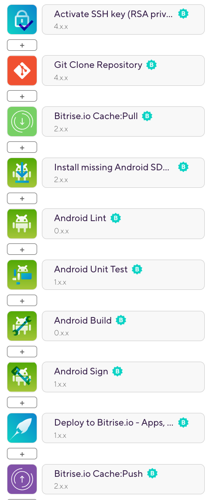

# Bitrise Android Sample TEST PUSH 47

This is a sample Android project that demonstrates a typical [Bitrise](https://bitrise.io) CI/CD setup. Build history is publicly available [here](https://app.bitrise.io/app/126b7fcfb72b97b4#/builds).

## Project setup and config

### Bitrise Workflow

#### `primary` Workflow

Workflow steps

This workflow is automatically run by Bitrise on every commit on every branch. This builds and tests only the debug variant for faster results. In addition to running lint and unit tests, the [Virtual Device Testing](https://www.bitrise.io/integrations/steps/virtual-device-testing-for-android) Step runs UI tests on a virtual device.

#### `deploy` Workflow

Workflow steps

This Workflow builds a release app and signs it with the release signing config (signing key and passwords are stored as secrets on Bitrise). The signing is done by the [**Android Sign**](https://www.bitrise.io/integrations/steps/sign-apk) Step, so there is no signing configuration defined in `build.gradle`.

You can run this workflow manually on Bitrise, or you can set up an automatic trigger. Additionally, you can [configure auto-incrementing version numbers with an extra step](https://devcenter.bitrise.io/builds/build-numbering-and-app-versioning/).

## Advanced use cases

While this repo demonstrates a simple project config on Bitrise, there are many advanced features that might be relevant for your project:

- [Generating multiple APKs (multi-flavor) in one workflow](https://devcenter.bitrise.io/deploy/android-deploy/generate-and-deploy-multiple-flavor-apks-in-a-single-workflow/)
- [Exporting a universal APK from an AAB](https://devcenter.bitrise.io/deploy/android-deploy/exporting-a-universal-apk-from-an-aab/)
- [Running tests in Visual Studio App Center](https://devcenter.bitrise.io/testing/run-your-tests-in-the-app-center/)
- [Measuring your code coverage with Codecov](https://devcenter.bitrise.io/testing/measuring-your-code-coverage-with-codecov/)
